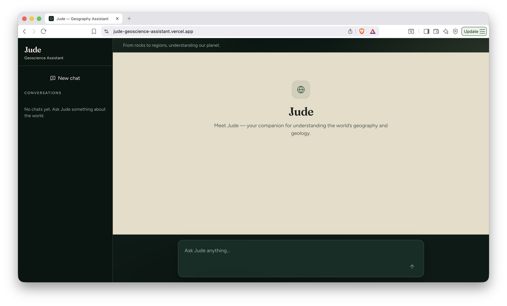
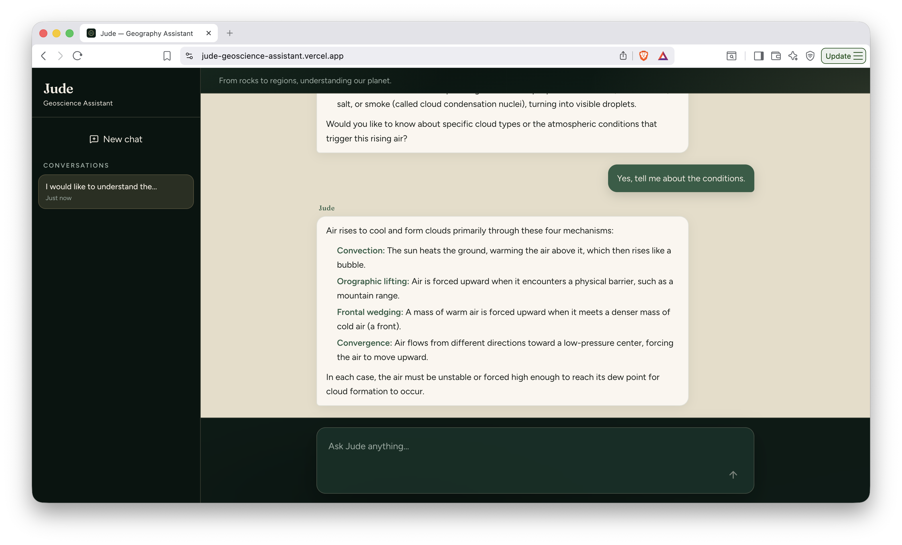
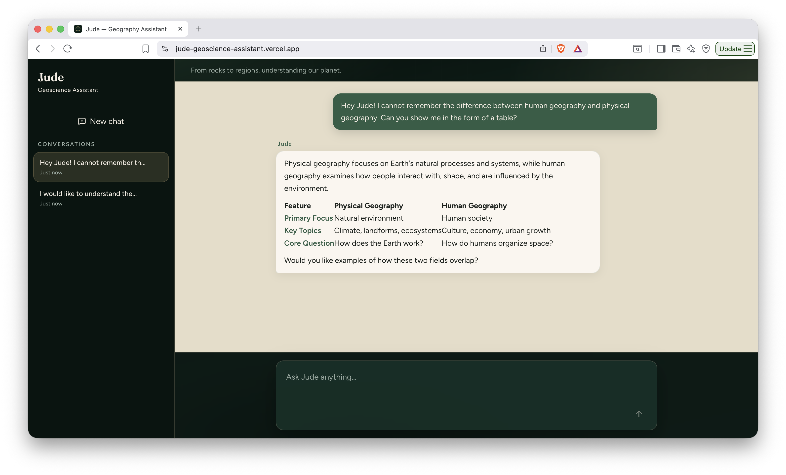
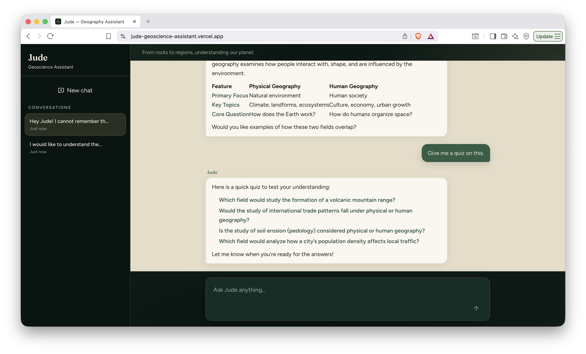
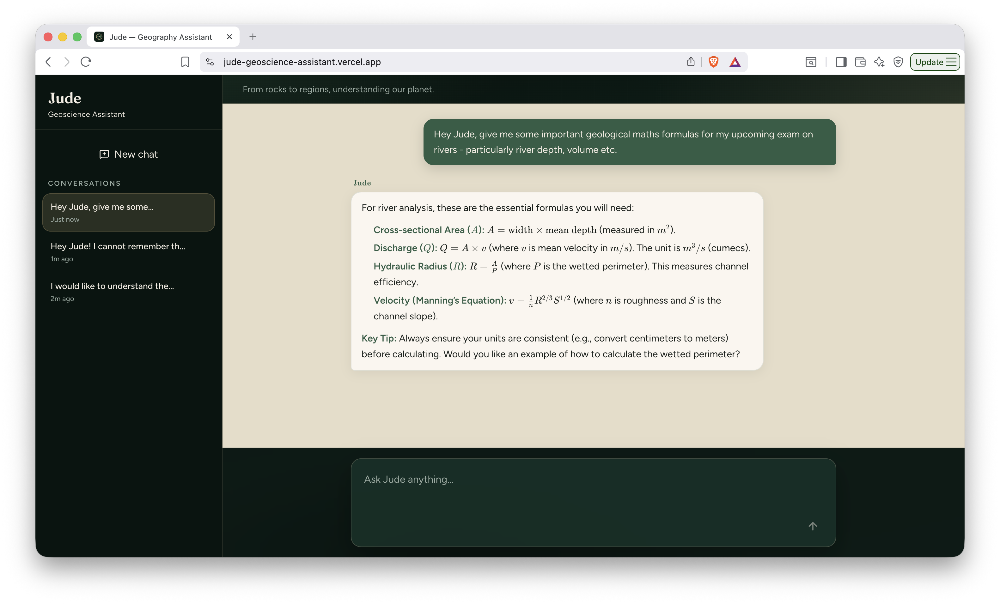
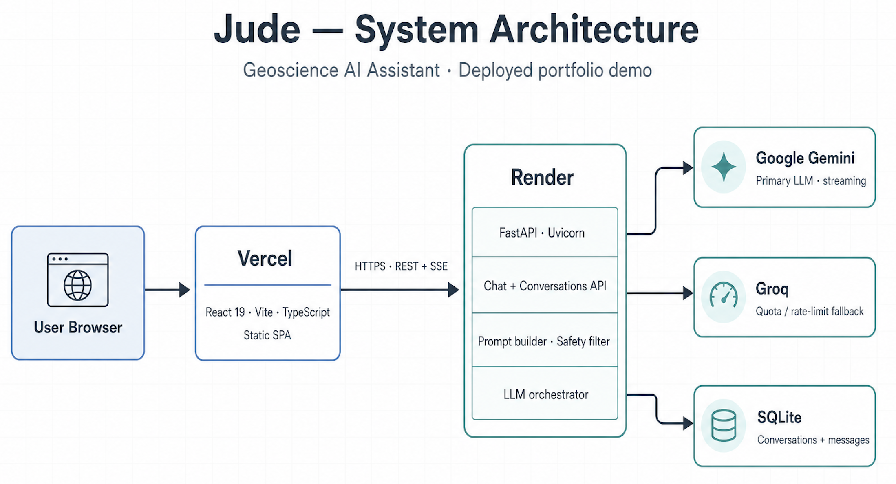

# Jude — Geoscience Assistant

**[Live demo →](https://jude-geoscience-assistant.vercel.app/)**


Jude is a domain-focused LLM application for geography and geology, combining prompt engineering, streaming inference, conversational memory, and full-stack deployment into an interactive learning assistant.

This is a **public AI assistant** with a try-then-save funnel: anyone can chat for free. Guest threads live only in the browser and disappear on refresh. Signing in persists private conversations per user.

| | |
|---|---|
| **Frontend** | Vercel — React + Vite SPA |
| **Backend** | Render — FastAPI + Uvicorn |
| **Auth** | Clerk (optional locally; required to save chats) |
| **LLM Providers** | Google Gemini primary, Groq fallback |
| **Database** | SQLite locally, Postgres in production |

## Overview

Jude allows users to ask geography and geology questions such as:
* *"Why do deserts form?"*
* *"Compare basalt and granite for field identification."*
* *"Which countries border Austria?"*

The system generates level-adaptive responses using a geoscience-focused prompt layer, streams responses token-by-token, supports Markdown and mathematical notation, and maintains persistent conversation threads.

## Jude in Action

### Initial chat interface

The application loads into a clean conversational state where users can begin interacting with Jude.



### Multi-turn conversations

Conversation history is maintained across messages, allowing users to build on previous questions.



### Domain comparisons

Jude can generate structured comparisons between geological concepts, including formatted tables for quick reference.



### Interactive learning

Jude can generate quiz-style interactions to help users test their understanding.



### Technical explanations

Jude supports mathematical notation and technical formatting for scientific explanations.




### AI Capabilites

- **Streaming LLM inference** through Server-Sent Events (meta → token → done / error)
- **Domain-focused prompting** using geoscience instructions and task-specific response modes
- **Multi-turn conversation memory** — guests keep context until refresh; signed-in users get private persisted threads
- **Provider resilience** through model retry and fallback handling
- **Structured response generation** for explanations, comparisons, geographic facts, concepts, and quizzes

## Architecture



```text
Browser
  └─ React + Vite (Vercel)
        │  HTTPS · JSON REST + SSE
        └─ FastAPI + Uvicorn (Render)
              ├── /api/chat           → prompts → Gemini (guest: no DB write)
              │                              ├─ lite-model retry
              │                              └─ quota fallback → Groq
              ├── /api/conversations  → Postgres (signed-in users only)
              └── /api/health         → database + provider status
```

Live API health: [`https://jude-geoscience-assistant.onrender.com/api/health`](https://jude-geoscience-assistant.onrender.com/api/health)

## Engineering highlights

### Streaming AI inference

Rather than waiting for a complete model response, Jude uses Server-Sent Events to stream generated tokens from the backend to the frontend. The client incrementally parses events and updates responses in real time with request cancellation support through `AbortController`.

### Reliable model orchestration

The backend includes failure handling around external LLM providers. Availability failures trigger model retries, while quota and rate-limit issues can switch generation to an alternative provider when configured.

### Modular backend design

The application separates API routes, Pydantic schemas, database persistence, prompt construction, safety filtering, and LLM provider adapters into independent components to keep the system maintainable and testable.

### Full-stack AI product delivery

The frontend provides a responsive interface for interacting with the deployed LLM system, including:

* streamed Markdown responses
* mathematical notation rendering with KaTeX
* persistent conversation sidebar
* responsive layouts
* custom geoscience-themed design system

### Automated quality checks

GitHub Actions validates changes through:

* backend pytest suite
* frontend linting
* frontend build checks
* automated testing on pull requests and main branch updates

## Local setup

**Prerequisites:** Python 3.12, Node.js 20+, Gemini and/or Groq API keys. Clerk keys are optional for local guest chat.

### Backend

```bash
cd backend
python3 -m venv .venv
source .venv/bin/activate
pip install -r requirements-dev.txt
cp .env.example .env
# Add API keys to .env
uvicorn app.main:app --reload --port 8000
```

### Frontend

```bash
cd frontend
npm install
cp .env.example .env
npm run dev
```

Open:

```text
http://127.0.0.1:5173
```

For local development, leave `VITE_API_BASE` unset and configure:

```text
VITE_API_PROXY_TARGET=http://127.0.0.1:8000
```

so Vite proxies API requests to FastAPI.

## Testing

```bash
cd frontend
npm run build
npm run lint
npm run test

cd ../backend
python -m pytest
```

To persist chats across refresh, create a Clerk application and set `VITE_CLERK_PUBLISHABLE_KEY` plus the backend `CLERK_*` variables. Guests can still chat without those keys.

## License

MIT — see [LICENSE](LICENSE).